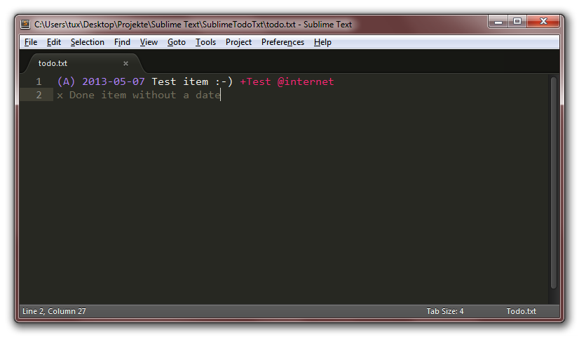

# SublimeTodoTxt #

This is [Todo.txt](http://todotxt.com) syntax highlighting support for [Sublime Text](http://www.sublimetext.com) (tested with Sublime Text 3).

## Background ##

I am currently using Todo.txt exclusively to manage all tasks which don't necessarily need to be set to a specific date (which is something the Todo.txt format can't handle by default). While there are some really great mobile apps for managing the Todo.txt file (via Dropbox), all available Windows GUIs are crap.

On the other hand, Todo.txt is a plain text format, so why waste GUI overhead? So I decided to add Todo.txt highlighting to Sublime Text.

## Current state ##

This repository contains everything that's needed to display plain Todo.txt files correctly.

### Installation ###

#### via Package Control (recommended) ####

SublimeTodoTxt is available from wbond's [Package Control](https://packagecontrol.io/) plug-in, you can find it as [Todo.txt Syntax](https://packagecontrol.io/packages/Todo.txt%20Syntax).

#### manually ####

If you don't want to use Package Control, just copy the syntax file into your Packages directory.

## Useful tricks ##

If you want Sublime Text to automatically save your Todo.txt file when the window loses its focus, just create a file named `TodoTxt.sublime-settings` in your `User` package, its contents are:

    {
       "save_on_focus_lost": true
    }
    
Now you're done.

## Future development ##

As Todo.txt is a rather simple format, I doubt that it's necessary to add any plug-in functionalities. Using menu items or shortcuts to change priorities and tags would probably be more effort than just changing the particular characters manually.

I do, however, plan to keep up with Sublime Text development, so once ST4 comes out and breaks stuff, I'll most likely be ready. In case there are any wishes, please drop by in the [forum thread](https://forum.sublimetext.com/t/sublimetodotxt-todo-txt-syntax-highlighting/10003) for SublimeTodoTxt. :-)

## Make me rich! ##

In case you are German and like what I do, feel free to install my [Amazon.de partner script](https://tuxproject.de/projects/vim/hf20.partnerlinks.user.js) (requires userscript support in your browser, like Firefox with the Greasemonkey extension) which adds my "tag" to all Amazon.de links. You can also lend me some Bitcoins, the preferred address is *1FJngJTiBiidA2HZ81xS9FGdrQmbQe2BHY*.
